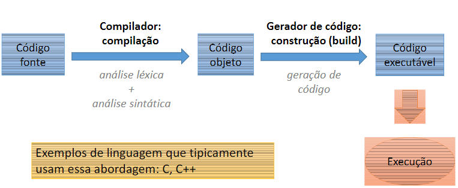
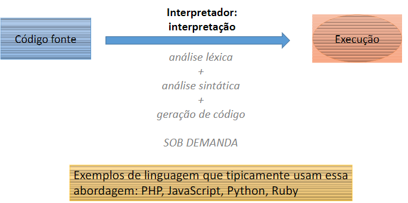
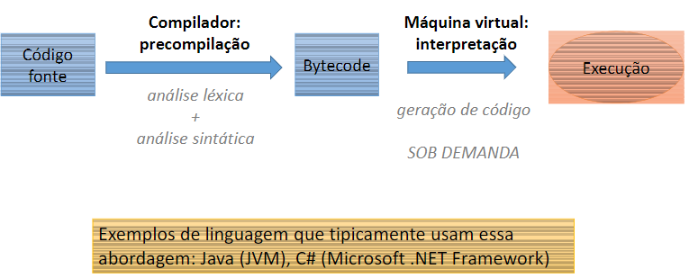
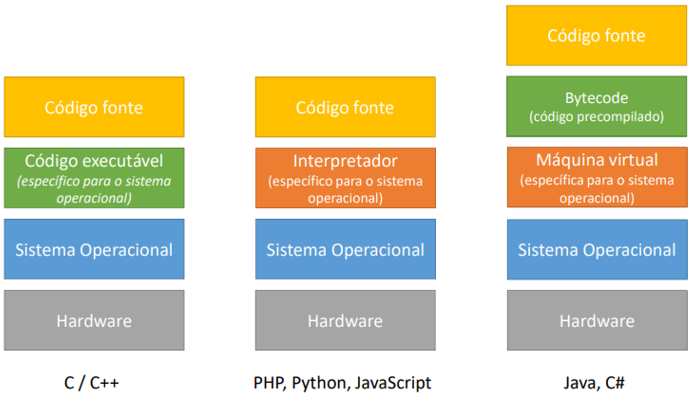

# Concepts

- **Lexical:** how the word is spelled;
    
    Ex.: dog != dogg
    
- **Syntactic:** the meaning of the words together;

# Tipos de Código

1. **Source Code:** writhed by the programmer;

2. **Bytecode:** intermediate form of code generated by compilers;
    
    *Is more abstract than source code but still not directly executable by hardware.*
    
    Ex.: Python & Java
    
3. **Object Code:** is more machine-near format and is used in compilers that produce native excutables.
    
    Ex.: C & C++
    

# Approaches to Code Execution

1. **Compilation:** make the Lexical and Syntactic analysis and then build the code;
    
    

    ✅ **Advantages:**
    
    1. Runs faster.
    
    ⛔ **Disadvantages:**
    
    1. Hard to maintain.
    
2. **Interpretation:** gradually reads the file lines;
    
    

    ✅ **Advantages:**
    
    1. Easy to understand and Maintain.
    
    ⛔ **Disadvantages:**
    
    1. Runs slower.

3. **Hybrid:** transform the source code into bytecode to be executed by the VM’s
    
    
    
    The JVM creates the`.class` file witch is executable only with the JVM.
    

---

___

<aside>
📎 About Java Versions:

- Java ME: Micro Edition → to mobile and IoT;
- Java SE: Standard Edition → desktop and Servers;
- Java EE: Enterprise Edition → Corp Apps.
</aside>
