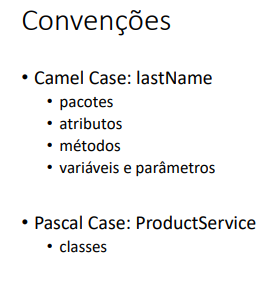
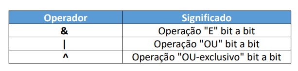
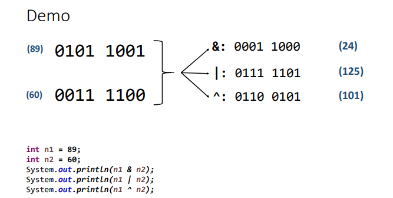
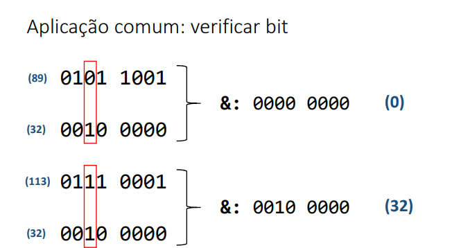

# Nomenclature

# Bitwise Operator

Low level operations

*Commonly used in web or infra projects.*

# Functions

- **`public`:** the function will be called outside the class;
- **`static`:** the function will be called without the need of an object;
