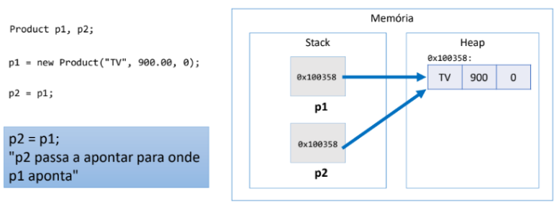
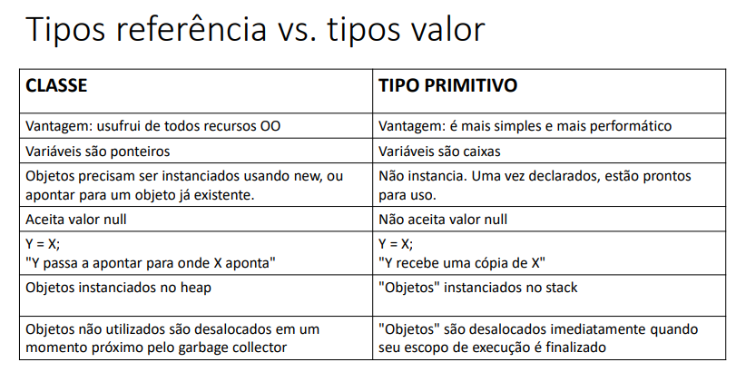
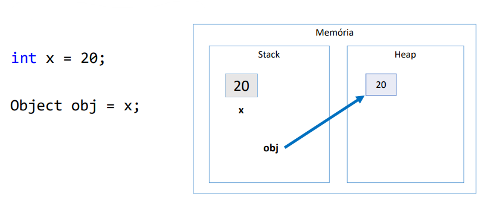
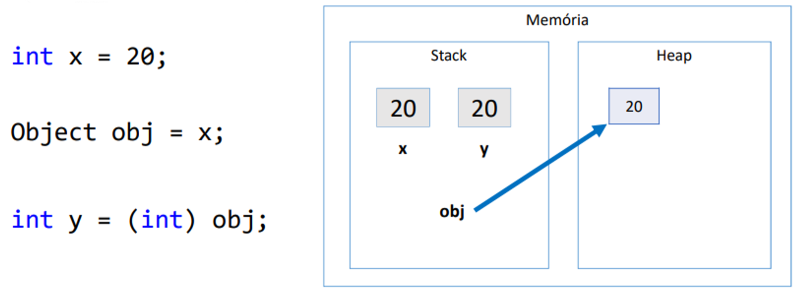
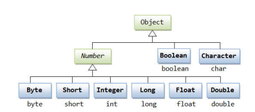
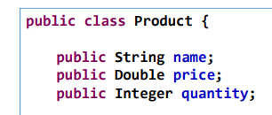

# Reference Types

**Pointer** to the actual value stored in the memory.

Reference Types: Classes, arrays.

- Run time objects are stored in the Heap memory
    
    *Store the memory address for the real object in the Stack memory.*
    



# Value Types

Store the actual value in the Stack Memory.

Value Types: primitive types.

---



---

# Boxing

Process of converting a value type object to a compatible reference type.




**OBS**: All classes, by default, are descendants of the `Object` class.

# Unboxing



Process of converting a reference type object to a compatible value type.

# Wrapper Classes



Used to perform Boxing and Unboxing properly.

<aside>
📌 A common use of Wrapper Classes:

**Entities in Information Systems.**

Reference types (classes) can accept null values and benefit from OO features
(inheritance, polymorphism…).

In other words, it's time to start using **Wrapper Classes**.



</aside>

---

# Lists

The `List` in front of an variable isn't a CLASS but insted a interface that
implements the List in the object.

**OBS:** The ArrayList in JAVA is an optimization for normal List. It's designed
to support a better iteration over the elements in the list.

- The list doesn't support the primitive types, only the Wrapper classes.

```Java
List<Integer> number;  // This < > operator is called GENERICS
```

## List Operations

### Adding

```Java
number.add(12); // Added on the last position;
number.add(0, 13); // Inserted the element '13' on index 0
```

### Size / Len

```Java
System.out.println(number.size());  // Len of the list

```

### Remove

```Java
// number.remove(2); // Removed on the position '2' => Index of Error
number.remove(1);

Integer[] otherList = {1, 2, 3, 4};
number.removeAll(Arrays.asList(otherList)); // Remove all the elements from
// the list `number` that also are in `otherList`.

number.removeFirst(); // Remove the first element

number.removeLast(); // Remove the last element

number.removeIf(x -> x % 2 == 0); // Remove as a Predicate - LAMBDAS
// Remove all the elements (x) from the list that are odd.

```

### Index

```Java
System.out.println("Postion of the number '3': " + number.indexOf(3)); // -1

System.out.println("Postion of the number '5': " + number.indexOf(5));

number.add(5);

System.out.println("Last Postion of the number '5': " + number.lastIndexOf(5));

```

### Stream
