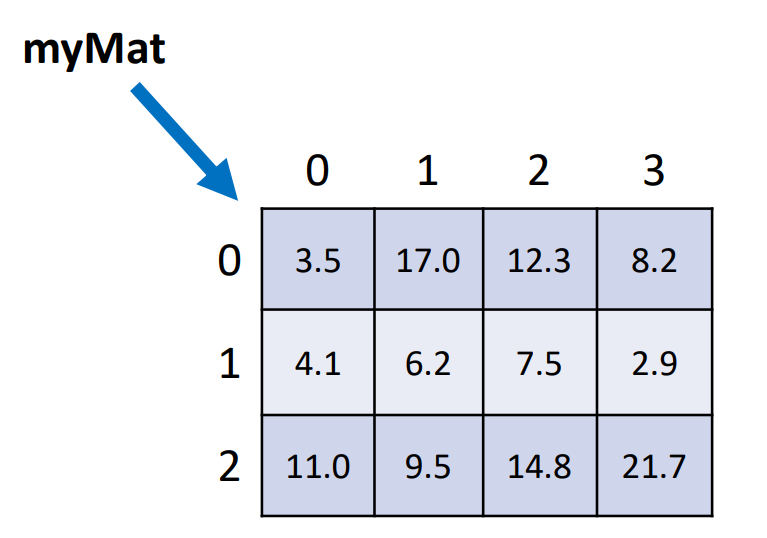

# Index

 - [Reference Types](#reference-types);
 - [Boxing](#boxing);
 - [UnBoxing](#unboxing);
 - [Wrapper Classes](#wrapper-classes);
 - [Lists](#lists);
    - [Stream on lists](#stream-on-lists);
 - [Matrices](#matrices);

---

# Reference Types

**Pointer** to the actual value stored in the memory.

Reference Types: Classes, arrays.

- Run time objects are stored in the Heap memory
  _Store the memory address for the real object in the Stack memory._


# Value Types

Store the actual value in the Stack Memory.

Value Types: primitive types.

---


---

# Boxing

Process of converting a value type object to a compatible reference type.


**OBS**: All classes, by default, are descendants of the `Object` class.

# Unboxing


Process of converting a reference type object to a compatible value type.

# Wrapper Classes


Used to perform Boxing and Unboxing properly.

<aside>
📌 A common use of Wrapper Classes:

**Entities in Information Systems.**

Reference types (classes) can accept null values and benefit from OO features
(inheritance, polymorphism…).

In other words, it's time to start using **Wrapper Classes**.


</aside>

---

# Lists

The `List` in front of an variable isn't a CLASS but insted a interface that
implements the List in the object.

**OBS:** The ArrayList in JAVA is an optimization for normal List. It's designed
to support a better iteration over the elements in the list.

- The list doesn't support the primitive types, only the Wrapper classes.

```Java
List<Integer> number;  // This < > operator is called GENERICS
```

## List Operations

### Adding

```Java
number.add(12); // Added on the last position;
number.add(0, 13); // Inserted the element '13' on index 0
```

### Size / Len

```Java
System.out.println(number.size());  // Len of the list

```

### Remove

```Java
// number.remove(2); // Removed on the position '2' => Index of Error
number.remove(1);

Integer[] otherList = {1, 2, 3, 4};
number.removeAll(Arrays.asList(otherList)); // Remove all the elements from
// the list `number` that also are in `otherList`.

number.removeFirst(); // Remove the first element

number.removeLast(); // Remove the last element

number.removeIf(x -> x % 2 == 0); // Remove as a Predicate - LAMBDAS
// Remove all the elements (x) from the list that are odd.

```

### Index

```Java
System.out.println("Postion of the number '3': " + number.indexOf(3)); // -1

System.out.println("Postion of the number '5': " + number.indexOf(5));

number.add(5);

System.out.println("Last Postion of the number '5': " + number.lastIndexOf(5));

```

### Stream on Lists

1. Parallel Stream: parallel computation;

    ```Java
    List<Integer> oddNumbers = numbers.parallelStream()
                                .filter(x -> x % 2 != 0)
                                .collect(Collectors.toList());
    ```

2. Map: change the value of the stream;

    ```Java
    List<Integer> doubleNumbers = numbers.stream()
                                    .map(x -> x * 2)
                                    .collect(Collectors.toList());
    ```

3. Filter: make an if filter between the values of the stream and return the
   `true` values;

    ```Java
    List<Integer> divisibleBy5and8 = numbers.stream()
                                    .map(x -> x * 10)
                                    .filter(x -> x % 5 == 0 && x % 8 == 0)
                                    .collect(Collectors.toList());
    ```

4. Find First: find the first value of the stream that satisfies the condition;

    ```Java
    Optional<Integer> firstEvenNumber = numbers.stream()  // Have to be Optional if the number doesn't exist
                                .filter(x -> x % 2 ==0)
                                .findFirst();

    System.out.println("First even number: " + firstEvenNumber.get()); // To get the actual value
    ```

5. Reduce: reduce the values of a strem to one variable;

    ```Java
    Integer sum = numbers.stream().reduce(1000, Integer::sum);  // Integer has a SUM funct
                                        // Start value
    System.out.println("Total Sum: " + sum);

    List<String> hey = new ArrayList<>(List.of("Hello", "World", "Java"));
    String helloString = hey.stream()
            .reduce("Concatenated String value: ", (a, b) -> a + "---" + b);
                                // Start value

    System.out.println(helloString);
    ```

6. Sorted: sort the values on the stream;

    ```Java
    List<String> sortedString = hey.stream()
                                .sorted()          // Sort the list
                                .distinct()        // Only the distinct values
                                .limit(10)         // On max 10 values
                                .collect(Collectors.toList()); // Collect

    ```

7. Peek: used to execute one function inside the stream. Usefull to debug.

    ```Java
    List<String> toUpper = hey.stream()
                            .filter(x -> x.length() > 3)
                            .peek(x ->  System.out.println("Word: " + x)) // Usefull when u want to debug
                            .map(String::toUpperCase)
                            .collect(Collectors.toList());
    ```


---

# Matrices


<aside>
🔥 The Matrix is a Array of Arrays. Each element in the first array - `matrix[i]`
 - is a pointer, reference to the other array.

</aside>

## Operations in Matrices

### Create

```java
int[][] mat = new int[n][n]; /* NxN Matrix 
```

### Reading Elements

```java
for (int i = 0; i < n; i++) { /* Loop for Rows */
  for (int j = 0; j < n; j++) { /* Loop for Columns */
      mat[i][j] = sc.nextInt();
  }
}

System.out.print(mat[1][3]); /* Specific element */
```

### `length` Property

Replaces the number of rows in a matrix

```java
mat.lengt
```

The number of columns can be expressed by:

```java
mat[i].length /* Calculating the number of elements within a row */
```
