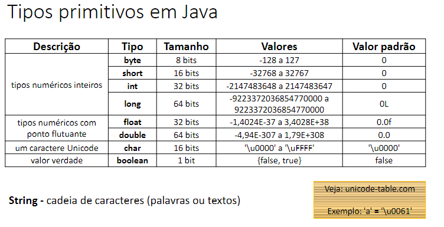

# Concepts

- In Java, everything is a Class;
- Package: logical grouping;
- Module: grouping of packages;

OBS: The Runtime is a physical grouping

- Application: grouping of Modules.

---

# Primitive Types




OBS: The double is preferred to the float type because is more precise.

---

# F Strings

- **`%s`** ⇒ for strings
    
    ```java
        System.out.printf("%20s", "ola formatado".toUpperCase());
        System.out.printf("   %-20s", "oi aqui");
        System.out.printf("Oi%n");

        /*
        * right to left format: positive numbers
        * left to right format: negative numbers
        */

        // Output:       OLA FORMATADO   oi aqui             Oi
    ```
- **`%d`** ⇒ for int
- **`%f`** ⇒ for float
- `%s` - String
- `%d` - Decimal integer
    
    ```java
            System.out.printf("%05d\n", number);
            // Output: 00009
    
            System.out.printf("%-5d Ola\n", number);
            // Output: 9     Ola
    ```
    
- `%f` - Floating-point number
    
    A way to format it is → **`%.2f`**
    
- `%x` - Hexadecimal integer
- `%c` - Character
- `%b` - Boolean
- `%n` ****or `\n` - new line

---

# Data Processing

```java
int a, b;

a = 5;
b = 2;

double result = a / b;

System.out.println(result);
// Output: 2 -> int / int == int
System.out.println((double) a / b);
// Output: 2.5 -> Casting it results to a double
```

```java
double a = 5.2456;
// int b = a; // => Can't set a double var to a int
int b = (int) a;  // => With the casting is all ok
```