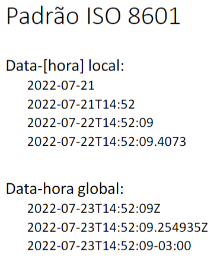
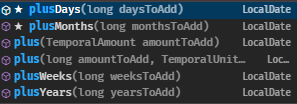

# Local Date-Time

**`year-month-day-hourWithoutTimezone`**

Recommended when the time is not relevant other users in different Timezones.

Ex: Excel, sales tracking.

# Global Date-Time

**`year-month-day-hourWithTimezone`**

Recommended when the time is relevant other users in different Timezones.

Ex: Multi-region systems, web, sales tracking.

**OBS:** Duration is the elapsed time between two date-time instances.

---

# Timezone

- GMT - Greenwich Mean Time → London
    
    Also called “Z”.
    

Ex.:

ING: GMT or Z

SP: GMT-3 or Z-3;

PT: GMT+1 or Z+1



Std for time in DB and APIs

---

# Operations with Time

**OBS:** All the DateTime objects in Java are immutable, so in operations u need to create a new variable.

All the operations have the specifiers - hours, days, months…



---

- Time Between:
    
    ```java
    Duration timeBetween = Duration.between(subInstant, d02);
                                         // StartTime    EndTime
    System.out.println(timeBetween.toDays());
    System.out.println(timeBetween.toHours());
    ```
    