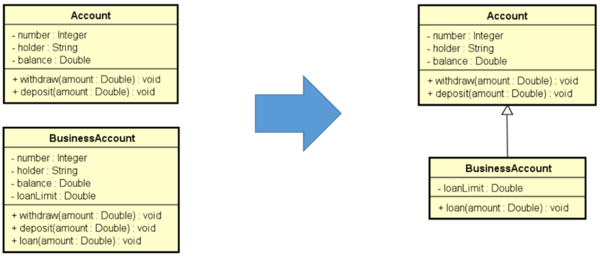
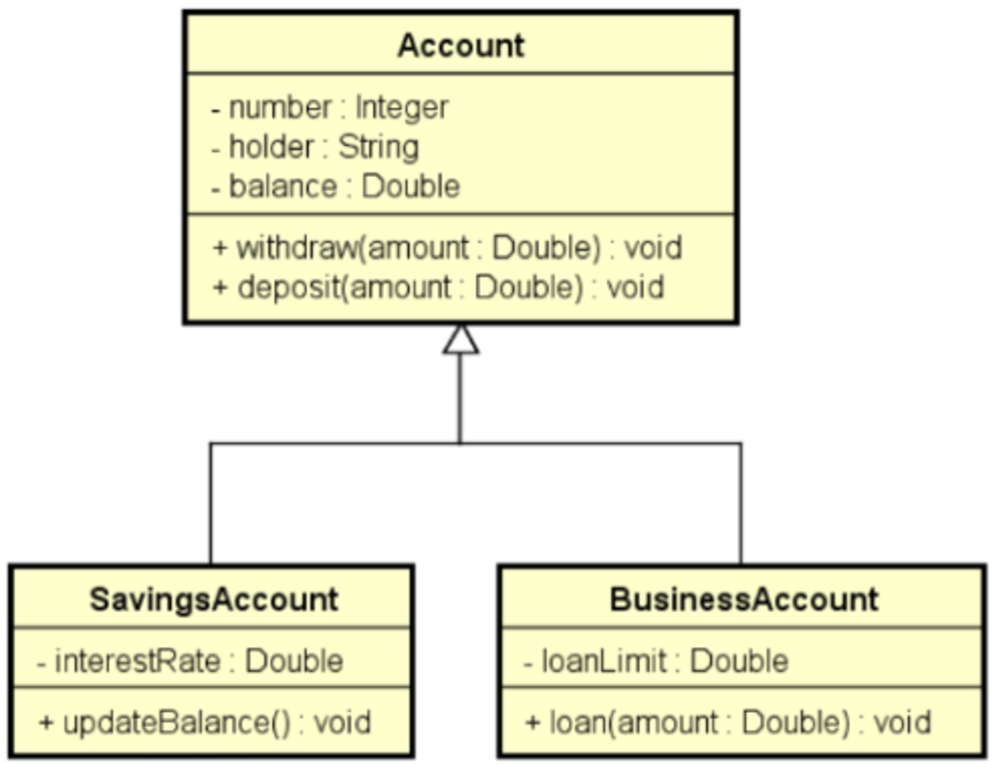

# Inheritance

Allows to a subclass, childclass to inherit attributes and methods from a superclass, fatherclass.



# Access Modifiers

- **`public`:**
    - Visibility: everywhere on the package;
- **`protected`:**
    - Visibility: same package + subclasses;
- **default - no modifier:**
    - Visibility: only within the same package;
- **`private`:**
    - Visibility: within the same class;

| Modifier | Class | Package | Subclass (same package) | Subclass (different package) | Global (other packages) |
| --- | --- | --- | --- | --- | --- |
| **public** | Yes | Yes | Yes | Yes | Yes |
| **protected** | Yes | Yes | Yes | Yes | No |
| **default** | Yes | Yes | Yes | No | No |
| **private** | Yes | No | No | No | No |

```java
public class Account {
    
    **protected** Integer number = 0;   // Now it's interesting to put the
    **protected** String holder = null; //  aproprieted att as protected so the sub
    **protected** Double balance = 0.0; // classes can access it
```

<aside>
🔥 Inheritance X Composition

Inheritance: The subclass has all the methods and att from the super class.

The instance of the subclass is just **one object**.

Composition: The object is a set of more than one class

</aside>

---

# UpCasting & DownCasting



```java
Account normalAcc = new Account(1234, "Lucas");

BusinessAccount bussinessAcc = new
    BusinessAccount(4556, "Lucas Samuel", 500.0, 1000.0);

SavingsAccount svsAcc = new SavingsAccount();
```

- Up: normal way, cast the subclass from the subclass
    - Ex.:
        
        ```java
        // UpCasting
        Account acc1 = bussinessAcc;
        Account acc2 = new BusinessAccount(12, "john", 900.0);
        Account acc3 = new SavingsAccount();
        ```
        
- Down: cast the super to a subclass. Normally used in generics.
    - Ex.:
        
        ```java
        // DownCasting
        // BusinessAccount bacc1 = acc1; // method not allowed
        BusinessAccount bacc1 =  (BusinessAccount) acc1;
        
        if (acc3 instanceof BusinessAccount) {
            BusinessAccount bacc2 = (BusinessAccount) acc3;
            System.out.println("LOAN!");
        }
        
        if (acc3 instanceof SavingsAccount) {
            SavingsAccount bacc2 = (SavingsAccount) acc3;
            System.out.println("UPADTE!");
        }
        ```
        

---

# `@Override`

Specifies a different behavior for a subclass when implementing a method from the superclass.

# `final`

- **Class:** Prevents the class from having subclasses, inherit;
- **Methods:** Prevents the `Overrride` of the method.

---

# Polymorphism

Different behave for different methods or classes.

```java
public class SavingsAccount **extends** Account{
```

---

# Abstract

- Classes: the abstract class won’t be instantiated, just the subclasses.
    
    They’re used just to set methods and att in common in classes.
    
    ```java
    public **abstract** class Account {
    ```
    
- Methods: used when the class has an generics type of implementation of that method.
    
    <aside>
    📌 If the class contains at least one abstract method, then the class is abstract as well.
    
    </aside>
    
    ```java
    public abstract class Shape {
    
        public abstract Double area();
        // Abstract methods doesn't need a body
    }
    ```
    

**OBS:** In UML the abstract have their name in *italic*.
